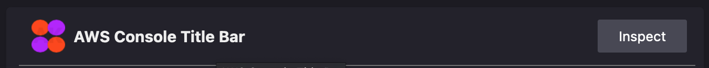

# AWS Console Title Bar

Chrome Plugin: [AWS Console Title Bar](https://chrome.google.com/webstore/detail/aws-console-title-bar/jhenfbkjfncfbimbkhakchbdefigenfp?hl=en)

FireFox Plugin [AWS Console Title Bar](https://addons.mozilla.org/en-GB/firefox/addon/aws-console-title-bar/)

The AWS Console Title Bar is a plugin designed to assist users of the AWS Console with SSO who have multiple accounts. It helps them identify the account they are currently logged into by displaying the account name on the menu bar in the console's top right corner.

To allow the plugin to work on each AWS Console URL, follow these steps:

1) Install the plugin.
2) Open the AWS Console.
3) Click on the plugin icon in the browser's toolbar. It will have a green dot on it.
4) From the drop-down menu, select "Allow on all AWS Console URLs" or a similar 5)option. This will ensure that the plugin works consistently across different AWS Console URLs.

## Export / Import of URLs

The plugin supports exporting and importing URLs. The following JSON structure can be used for exporting and importing URLs:

```json
{
    "urls":[
        {"url":"https://akfdev.com","title":"AKFDEV.con"},
        {"url":"https://akfdev.awsapps.com/start","title":"AWS Console: just-ak"},
        {"url":"https://d-9c6715bd19.awsapps.com/start","title":"AWS Console : TORG"}
    ]
}
```

## Development

### Firefox

To submit the extension to Firefox, visit [https://addons.mozilla.org/en-US/developers/addons](https://addons.mozilla.org/en-US/developers/addons).

For debugging, access [about:debugging#/runtime/this-firefox](about:debugging#/runtime/this-firefox) and use the Inspect option within the plugins section. Here's an example screenshot of how to access it:



Submit the extension at [https://addons.mozilla.org/en-US/developers/addon/aws-console-title-bar/versions/submit/](https://addons.mozilla.org/en-US/developers/addon/aws-console-title-bar/versions/submit/).

### Chrome

For Chrome development, go to [chrome://extensions/](chrome://extensions/) and turn on Developer Mode. Then, load the unpacked extension.

Access the Chrome Web Store for more information:

- [https://chrome.google.com/webstore/devconsole/80050481-57f7-4a10-8bb4-7e6dfe5bec47/jhenfbkjfncfbimbkhakchbdefigenfp/edit/package](https://chrome.google.com/webstore/devconsole/80050481-57f7-4a10-8bb4-7e6dfe5bec47/jhenfbkjfncfbimbkhakchbdefigenfp/edit/package)

## Current Problems

There are a couple of known issues with the plugin:

1. Browser plugins don't resize correctly after creation.
2. The HTML5 color picker doesn't work properly on Firefox for browser plugins. The plugin uses [https://github.com/mdbassit/Coloris](https://github.com/mdbassit/Coloris) as a workaround.

## Manifest V3 Migration

For information on migrating to Manifest V3 in Chrome extensions, refer to [https://developer.chrome.com/docs/extensions/migrating/to-service-workers/#move-dom-and-window](https://developer.chrome.com/docs/extensions/migrating/to-service-workers/#move-dom-and-window).
